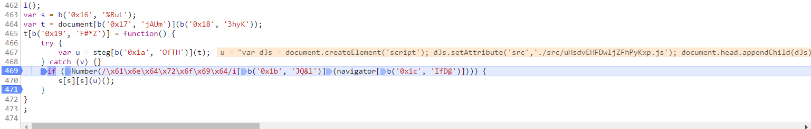
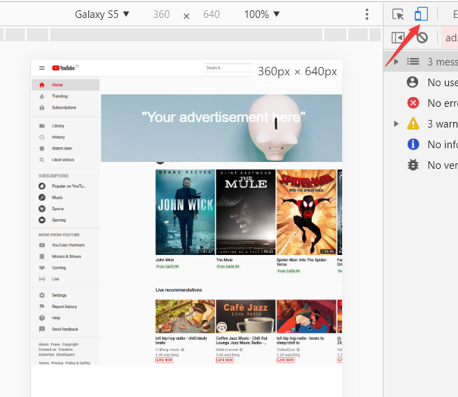
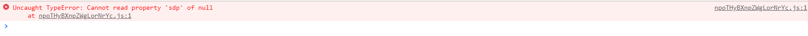
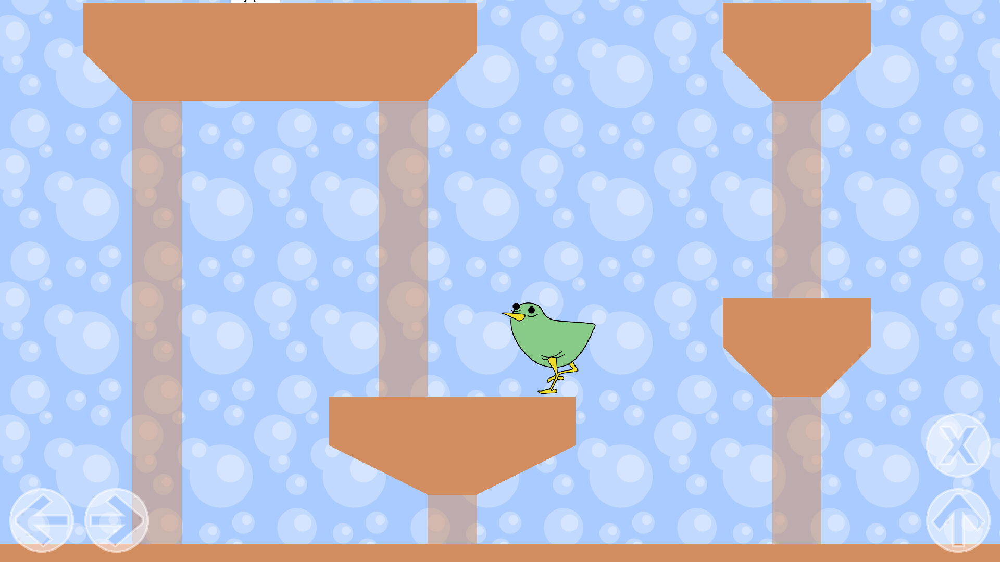
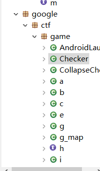
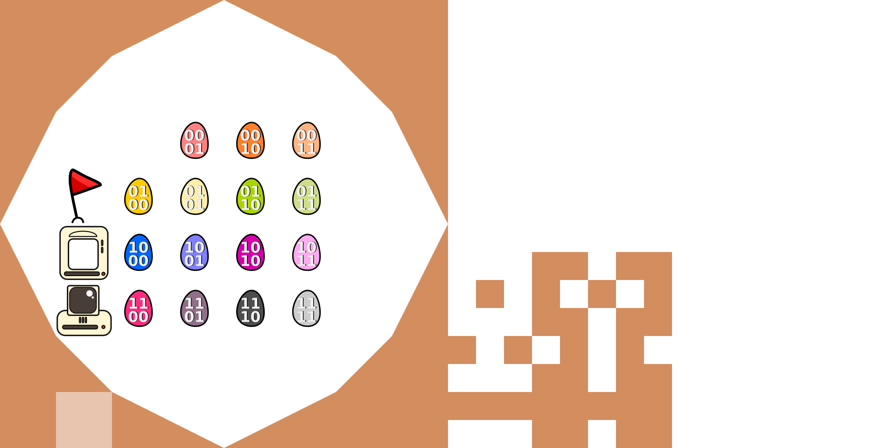
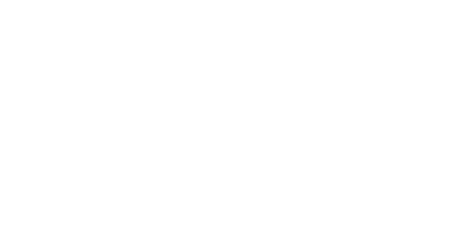
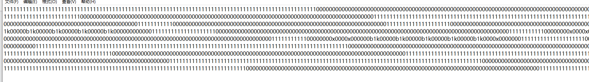
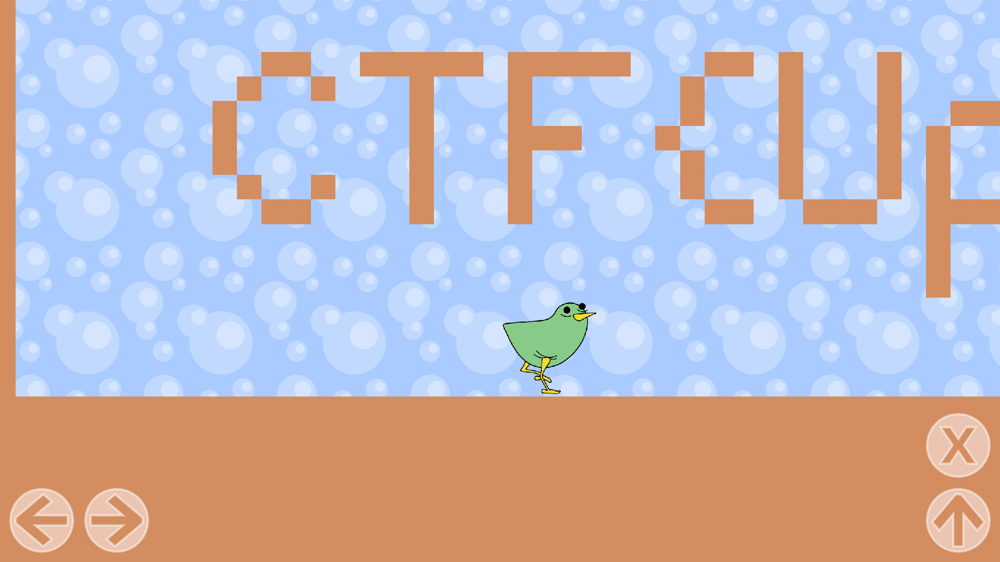

7月某天兴起玩了一下googlectf，发现很有意思。不过最后一个也没做出来，都是赛后重新学的。这里把wp放出来和大家分享一哈。
_PS:整个wp太长了，所以就分成两部分了

<!--more-->

2019 GoogleCTF part1
--------------------------

# Rev

## Malvertising
这个题目本意是模拟了恶意广告（那种覆盖页面，点击后会跳转的广告），然后顺着混淆的`js`脚本找到源头，所以和`Reverse`相关，但是全部都是发生在Web段。。。

### Stage1 
题目是一个url`https://malvertising.web.ctfcompetition.com`

随便点击之后就会跳转到`google.com`上。对当前界面的代码进行审计，可以看到如下关键代码:

```html
<script>
  function click() {
    window.top.location.href = "http://www.google.com";
  }
  document.addEventListener("click", click)
</script>
<script id="adjs" src="./src/metrics.js" type="text/javascript"></script>
```
这个地方尝试加载了一个js脚本，于是去资源中找到这个脚本，不过基本上是看不懂的。。。用Chrome自带的格式化工具处理一下后，找到关键代码:
```javascript
// 省略前面一大段
var s = b('0x16', '%RuL');
var t = document[b('0x17', 'jAUm')](b('0x18', '3hyK'));
t[b('0x19', 'F#*Z')] = function() {
    try {
        var u = steg[b('0x1a', 'OfTH')](t);
    } catch (v) {}
    if (Number(/\x61\x6e\x64\x72\x6f\x69\x64/i[b('0x1b', 'JQ&l')](navigator[b('0x1c', 'IfD@')]))) {
        s[s][s](u)();
    }
}
;
```
结合之前的逻辑分析，会发现函数`b`被反复的调用。并且动态调试后注意到，这个函数会对一些加密的内容进行解密，于是动态跟踪程序，在如下的位置下断点:

可以发现，这个地方解开了一段加载js的代码。然后在如下的位置:
```javascript
if (Number(/\x61\x6e\x64\x72\x6f\x69\x64/i[b('0x1b', 'JQ&l')](navigator[b('0x1c', 'IfD@')]))) {
    s[s][s](u)();
}
```
对加载的逻辑进行了判断。这个地方利用了js的各种特性，编码的部分扔到`console`里面可以得到如下结果:
```
'/\x61\x6e\x64\x72\x6f\x69\x64/i'
"/android/i"
```
直译过来就是
```js
if (Number(/android/i["test"](navigator["userAgent"])))
```
正则后面跟着`["test"]`，就是利用js的特性，其实本质上是调用了`/android/i.test`的正则匹配。这里的意思相当于说：读出当前浏览器的`userAgent`，并且检测其中是否包含`Android`字样。为了解决这个问题，可以利用Chrome的`Toggle Device Bar`模拟切换浏览设备，如下:

这样就会进入第二个js文件

### Stage2
第二个js文件的内容如下:
```js
// 省略一些不必要的内容
var T = {};
T.d0 = function(a, b) {
    var c, d;
    return a = String(a),
    b = String(b),
    0 == a.length ? '' : (c = T.f0(a.b1()),
    d = T.f0(b.u0().slice(0, 16)),
    c.length,
    c = T.d1(c, d),
    a = T.longsToStr(c),
    a = a.replace(/\0+$/, ''),
    a.u1())
}
,
T.d1 = function(a, b) {
    for (var c, d, e, f = a.length, g = a[f - 1], h = a[0], i = 2654435769, j = Math.floor(6 + 52 / f), k = j * i; 0 != k; ) {
        for (d = 3 & k >>> 2,
        e = f - 1; e >= 0; e--)
            g = a[e > 0 ? e - 1 : f - 1],
            c = (g >>> 5 ^ h << 2) + (h >>> 3 ^ g << 4) ^ (k ^ h) + (b[3 & e ^ d] ^ g),
            h = a[e] -= c;
        k -= i
    }
    return a
}
,
T.f0 = function(a) {
    var b, c = new Array(Math.ceil(a.length / 4));
    for (b = 0; b < c.length; b++)
        c[b] = a.charCodeAt(4 * b) + (a.charCodeAt(4 * b + 1) << 8) + (a.charCodeAt(4 * b + 2) << 16) + (a.charCodeAt(4 * b + 3) << 24);
    return c
}
,
T.longsToStr = function(a) {
    var b, c = new Array(a.length);
    for (b = 0; b < a.length; b++)
        c[b] = String.fromCharCode(255 & a[b], 255 & a[b] >>> 8, 255 & a[b] >>> 16, 255 & a[b] >>> 24);
    return c.join('')
}
,
'undefined' == typeof String.prototype.u0 && (String.prototype.u0 = function() {
    return unescape(encodeURIComponent(this))
}
),
'undefined' == typeof String.prototype.u1 && (String.prototype.u1 = function() {
    try {
        return decodeURIComponent(escape(this))
    } catch (a) {
        return this
    }
}
),
'undefined' == typeof String.prototype.b0 && (String.prototype.b0 = function() {
    if ('undefined' != typeof btoa)
        return btoa(this);
    if ('undefined' != typeof Buffer)
        return new Buffer(this,'utf8').toString('base64');
    throw new Error('err')
}
),
'undefined' == typeof String.prototype.b1 && (String.prototype.b1 = function() {
    if ('undefined' != typeof atob)
        return atob(this);
    if ('undefined' != typeof Buffer)
        return new Buffer(this,'base64').toString('utf8');
    throw new Error('err')
}
),
'undefined' != typeof module && module.exports && (module.exports = T),
'function' == typeof define && define.amd && define([''], function() {
    return T
});
function dJw() {
    try {
        return navigator.platform.toUpperCase().substr(0, 5) +  //WIN32
        Number(/android/i.test(navigator.userAgent)) +          //1(sure, because we use this enter)
        Number(/AdsBot/i.test(navigator.userAgent)) +           //0,1
        Number(/Google/i.test(navigator.userAgent)) +           //0,1
        Number(/geoedge/i.test(navigator.userAgent)) +          //0,1
        Number(/tmt/i.test(navigator.userAgent)) +              //0,1 
        navigator.language.toUpperCase().substr(0, 2) +         //many....(ZH,EN,FR,EN,DE,JP)
        Number(/tpc.googlesyndication.com/i.test(document.referrer) || /doubleclick.net/i.test(document.referrer)) + //0,1
        Number(/geoedge/i.test(document.referrer)) +            //0,1
        Number(/tmt/i.test(document.referrer)) +                //0,1(以上三者互斥)
        performance.navigation.type +                           // (0,1,2,255)
        performance.navigation.redirectCount +                  // 0,1
        Number(navigator.cookieEnabled) +                       // true
        Number(navigator.onLine) +                              // true
        navigator.appCodeName.toUpperCase().substr(0, 7) +      // MOZILLA
        Number(navigator.maxTouchPoints > 0) +                  // 0,1
        Number((undefined == window.chrome) ? true : (undefined == window.chrome.app)) + //0,1
        navigator.plugins.length                                //0,1,2,3
    } catch (e) {
        return 'err'
    }
}
;a = "A2xcVTrDuF+EqdD8VibVZIWY2k334hwWPsIzgPgmHSapj+zeDlPqH/RHlpVCitdlxQQfzOjO01xCW/6TNqkciPRbOZsizdYNf5eEOgghG0YhmIplCBLhGdxmnvsIT/69I08I/ZvIxkWyufhLayTDzFeGZlPQfjqtY8Wr59Lkw/JggztpJYPWng=="
// "WIN3210000ZH0000011MOZILLA100"
eval(T.d0(a, dJw()));
```
这个地方会检测一大堆的属性，并且检测我们当前的浏览器是否符合这些属性，然后用这个属性组合的密钥对一段密文进行解密。这个地方比较头疼，需要一个爆破逻辑。。。不过有几个地方可以限制一下爆破的范围:

  * 前文我们是通过修改成`Android`的操作系统，那么这个时候`platform`就是`Linux`
  * 测试发现，有几位数是不生效的

然而因为编码问题，以为是上述思维有错，最后写了一个完全爆破脚本。。。
```js
function main_func(){
    s15 = ""
    for(i = 0;i <3; i ++){
        var platform = ["ANDRO", 'LINUX','WIN32']
        s1 = platform[i]
        for(j = 1; j < 2; j++){//Number(/android/i.test(navigator.userAgent))
            s2 = s1 + j
            for(k=0; k < 2; k++){//Number(/AdsBot/i.test(navigator.userAgent))
                s3 = s2 + k
                console.log("Now s15 is " + s15)
                for(l = 0; l < 2; l++){//Number(/Google/i.test(navigator.userAgent))
                    s4 = s3 + l;
                    for(m = 0; m < 2; m++){//Number(/geoedge/i.test(navigator.userAgent))
                        s5 = s4 + m
                        for(n = 0; n < 2; n++){//Number(/tmt/i.test(navigator.userAgent))
                            s6 = s5 + n
                            for(o = 0; o < 6; o++){//navigator.language.toUpperCase().substr(0, 2)
                                var lan = ["ZH","EN","FR","EN","DE","JP"]
                                s7 = s6 + lan[o]
                                for(p = 0; p < 2; p++){//Number(/tpc.googlesyndication.com/i.test(document.referrer) || /doubleclick.net/i.test(document.referrer))
                                    s8 = s7 + p
                                    for(q = 0; q < 2; q++){//Number(/geoedge/i.test(document.referrer)){
                                        s9 = s8 +q
                                        for(r = 0; r < 2; r++){//Number(/tmt/i.test(document.referrer))
                                            s10 = s9 + r
                                            for(s = 0; s < 4; s++){//performance.navigation.type
                                                var types=[0,1,2,255]
                                                s11 = s10 + types[s]
                                                for(t = 0; t < 2; t++){//performance.navigation.redirectCount
                                                    s12 = s11 + t
                                                    s12 = s12 + 0 + 0 + "MOZILLA"
                                                    for(u = 0; u < 2; u++){//Number(navigator.maxTouchPoints > 0)
                                                        s13 = s12 +u
                                                        for(v = 0; v < 2; v++){//Number((undefined == window.chrome) ? true : (undefined == window.chrome.app))
                                                            s14 = s13 + v
                                                            for(w = 0; w < 4; w++){//navigator.plugins.length
                                                                s15 = s14 + w
                                                                try {
                                                                    // console.log(s15)
                                                                    // if(s15 == "LINUX10000FR1000000MOZILLA000"){
                                                                        console.log(T.d0(a, s15).toString("utf8"));
                                                                        console.log("\nand now the answer is :\n")
                                                                        // console.log(T.d0(a, "LINUX11000FR1000000MOZILLA000"))
                                                                        console.log(eval(T.d0(a, s15)).toString())
                                                                    // }
                                                                    // console.log("success")
                                                                    // return 
                                                                } catch (error) {
                                                                    console.log(error)
                                                                }
                                                            }
                                                        }
                                                    }
                                                }
                                            }
                                        }
                                    }
                                }
                            }
                        }
                    }
                }
            }
        }
    }
}
```
但是最后还是爆不出答案.....结果知道比赛结束都没能做出来。之后仔细检查了逻辑，发现其实是比赛给的`btoa`实现有问题！[https://github.com/EmpireCTF/empirectf/tree/master/writeups/2019-06-22-Google-CTF-Quals#140-reversing--malvertising](这里的哥们也提到了这个问题)。我重新用`npm`下载了一个数据包，然后再次爆破，终于能够找到可见字符:
```
and now the answer is :

ReferenceError: document is not defined
    at eval (eval at main_func (D:\Daily\Competition\Google\2019\Reverse\Youtube_files\burce.js:157:85), <anonymous>:1:11)
    at main_func (D:\Daily\Competition\Google\2019\Reverse\Youtube_files\burce.js:157:85)
    at Object.<anonymous> (D:\Daily\Competition\Google\2019\Reverse\Youtube_files\burce.js:188:1)
    at Module._compile (internal/modules/cjs/loader.js:776:30)
    at Object.Module._extensions..js (internal/modules/cjs/loader.js:787:10)
    at Module.load (internal/modules/cjs/loader.js:653:32)
    at tryModuleLoad (internal/modules/cjs/loader.js:593:12)
    at Function.Module._load (internal/modules/cjs/loader.js:585:3)
    at Function.Module.runMain (internal/modules/cjs/loader.js:829:12)
    at startup (internal/bootstrap/node.js:283:19)

var dJs = document.createElement('script'); dJs.setAttribute('src','./src/npoTHyBXnpZWgLorNrYc.js'); document.head.appendChild(dJs);    
```
于是赶紧去找到了这个文件


### Stage3
这个文件里面也使用了和**Stage1**中类似的算法，并且这一次上了反调试，如果使用调试器的话，会陷入一个死循环中出不来，而直接运行脚本，又会有如下的错误（我看网上的wp似乎没遇到这个问题。。）

考虑到隐藏的内容可能包含了答案，于是简单逆向，找到了加密算法`_0x5877`，并且写了一个小jio本把里面所有调用的函数都捞了出来:
```
_0x5877("0x0", "fYVo") !== "csEBi")
_0x5877("0x1", "cw[y")
_0x5877("0x2", "R2OT") !== _0x5877("0x3", "WlSm")
_0x5877("0x4", "adOx")
_0x5877("0x5", "R2OT"), "i")
_0x5877("0x6", "5&eh")
_0x5877("0x7", "aLUv")) || !n[_0x5877("0x8", "5&eh")](f + _0x5877("0x9", "F(E#")
_0x5877("0xa", "Q&C3") === _0x5877("0xb", "QwV5")
_0x5877("0xc", "E7P9") !== _0x5877("0xd", "E7O$")
_0x5877("0xe", "w(zO")
_0x5877("0xf", "iOa(")] || ifr[_0x5877("0x10", "dC5K")
_0x5877("0x11", "h#9[")
_0x5877("0x12", "dC5K") === _0x5877("0x13", "QwV5")
_0x5877("0x14", "p1IC") === _0x5877("0x15", "4Nbx")
_0x5877("0x16", ")m$x")]("script")
_0x5877("0x17", "jEx@"), _0x5877("0x18", "L]47")
_0x5877("0x19", "ZE[y")][_0x5877("0x1a", "6ql8")
_0x5877("0x1b", "KfX2")
_0x5877("0x1c", "tP$Y") === _0x5877("0x1d", "adOx")
_0x5877("0x1e", "%8cb") + _0x5877("0x1f", "tP$Y") + ");")
_0x5877("0x20", "Q&C3") !== _0x5877("0x21", "%!Aa")
_0x5877("0x22", "6ql8")
_0x5877("0x23", "Q&C3")
```
一个个试了一下。。最后找到了关键的解密逻辑:
```
 _0x5877("0x18", "L]47")
"./src/WFmJWvYBQmZnedwpdQBU.js"
```
于是访问[https://malvertising.web.ctfcompetition.com/ads/src/WFmJWvYBQmZnedwpdQBU.js](最后答案)，找到flag为
```
alert("CTF{I-LOVE-MALVERTISING-wkJsuw}")
```

## Flappybird

许久不做Android，找一个题目来找一下手感。
这个题目是一个游戏题，内容如下:

操作起来及其难受。

然后拖到工具里面查看，内容包大致如下:


其中有部分内容我简单逆向了一下。里面很多的类和对象都被混淆成了abcd，简单逆向之后，大致的功能分为三类

 * 用于渲染游戏主体的部分
 * 用于加载游戏和控制游戏的类
 * 奇怪的Checker

### 检查加密
唯一的`Checker`没有被处理，并且可以在其中找到一个native方法：
```java

class Checker {
    private static final byte[] hash;
    private static final byte[] IV;
    private static final byte[] Data;

    static {
        Checker.hash = new byte[]{46, 50, 92, -111, -55, 20, 120, -77, 92, 46, 12, -74, 91, 120, 81, -58, -6, -104, -123, 90, 0x77, -61, -65, -45, -16, 8, 0x40, -68, -103, -84, -30, 107};
        Checker.IV = new byte[]{-30, 1, 9, -29, -92, 104, -52, -82, 42, -116, 1, -58, 92, -56, -25, 62};
        Checker.Data = new byte[]{-113, -47, -15, 105, -18, 14, -118, 0x7A, 103, 93, 120, 70, -36, -82, 109, 0x71, 36// 省略一些内容;
    }
    Checker() {
        super();
    }

    private byte[] DecryptData(byte[] key, byte[] data) {
        try {
            IvParameterSpec v0 = new IvParameterSpec(Checker.IV);
            SecretKeySpec v1 = new SecretKeySpec(key, "AES");
            Cipher v4 = Cipher.getInstance("AES/CBC/PKCS5PADDING");
            v4.init(2, ((Key)v1), ((AlgorithmParameterSpec)v0));
            return v4.doFinal(data);
        }
        catch(Exception ) {
            return null;
        }
    }

    byte[] CheckAndDecrypt(byte[] key) {
        if(this.nativeCheck(key)) {
            try {
                if(Arrays.equals(MessageDigest.getInstance("SHA-256").digest(key), Checker.hash)) {
                    return this.DecryptData(key, Checker.Data);
                }

                return null;
            }
            catch(Exception ) {
                return null;
            }
        }

        return null;
    }

    public native boolean nativeCheck(byte[] arg1) {
    }
}

```
这个checker中调用的`checkAndDecrypt`方法最后会被一个如下的方法调用:
```java
   void ShowSecret() {  // [import]check
        byte[] message = new byte[0x20];
        int i;
        for(i = 0; i < this.egg_place.length; ++i) {
            int j;
            for(j = 0; j < g_map.egg_lists.length; ++j) {
                if(this.egg_place[i] == g_map.egg_lists[j]) {  // [import]check
                    message[i] = ((byte)j);
                }
            }
        }

        message = new Checker().CheckAndDecrypt(message);
        if(message != null) {
            try {
                this.level = 0;
                this.CallMessageToGenerateMap(message);
            }
            catch(IOException ) {
            }
        }
        else {
            this.g.a("Close, but no cigar.");
        }
    }
```
简单来说，就是解密后的数据会被传入`CallMessageToGenerateMap`，当成地图程序处理，然后会被渲染到当前的程序中。但是下载游戏后发现，并没有可以进行输入的地方（至少前两关是没有的）

### 寻找交互点
这就很奇怪了，一般来说rev不会没有交互就直接退出的（不然的话就不是reverse了）。不过有一个地方说明了程序是存在一个可以与用户交互的地方的:
```java
byte[] message = new byte[0x20];
int i;
for(i = 0; i < this.egg_place.length; ++i) {
    int j;
    for(j = 0; j < g_map.egg_lists.length; ++j) {
        if(this.egg_place[i] == g_map.egg_lists[j]) {  // [import]check
            message[i] = ((byte)j);
        }
    }
}

message = new Checker().CheckAndDecrypt(message);
```
这里可以发现，解密用的message是由程序自己生成的，也就是说程序还是给了一个可以交互的地方，让用户通过与程序交互，使得`egg_place`与`egg_lists`里面的数据能够相等。这里的`egg_lists`是一开始就确定了的:
```java

    static {
        g_map.egg_lists = new Enum_Res[]{Enum_Res.Egg_0,....};  // 生成egg_list
    }
```
所以，我们可以关注一下`egg_place`的发生赋值的位置。
```java
// 首先是初始化的位置
CallMessageToGenerateMap()
{
    // 这个位置的话是初始化了所有的egg
    this.egg_places = new Enum_Res[this.egg_number];
    while(egg_resource < this.egg_places.length) {
    this.egg_places[egg_resource] = Enum_Res.Egg_0;  // 如果有超过16个egg_holder，那么剩下的位置全部换成egg_0
    ++egg_resource;
}
```
可以看到，初始化的时候会根据`egg_number`的数量进行初始化。也就是说只有**当前地图中存在egg_holder，才至少有一个egg会被初始化**
然后还有一个赋值函数:
```java
// 然后是官方钦定的赋值函数
    void GetEgg(int now_egg_index, int egg_type) {
        this.egg_places[now_egg_index] = g_map.egg_lists[egg_type];
        int v1 = -1;
        int tmp_egg_type = 0;
        int now_egg_type = -1;
        while(tmp_egg_type < this.recently_egg_place.size()) {
            if(this.recently_egg_place.get(tmp_egg_type).intValue() == now_egg_index) {
                if(egg_type != 0) {
                    return;
                }
                else {
                    now_egg_type = tmp_egg_type;  // 找到当前的egg_type
                }
            }

            ++tmp_egg_type;
        }

        if(now_egg_type != v1) {
            this.recently_egg_place.remove(now_egg_type);
        }

        if(egg_type == 0) {
            return;
        }

        this.recently_egg_place.add(Integer.valueOf(now_egg_index));
        if(this.recently_egg_place.size() > 15) {
            this.egg_places[this.recently_egg_place.remove(0).intValue()] = Enum_Res.Egg_0;  // 去除当前的下标，设置为egg_0
        }
    }
```
赋值函数`GetEgg`中，会将当前存储了egg类型的`egg_lists`中对应的egg放到`egg_places`中，并且从存放了最近操作的egg类型的`recently_egg_place`中移除。其中的两个变量主要含义为：

 * `egg_places_index`记录了最近放了egg的egg_holder的下标
 * `egg_places`记录了每一个egg_holder中放入的egg的种类

整个函数的实际作用就是：虽然存在32个`egg_places`，但是只有最先操作的16个`egg_places`能够存放非`Egg_0`种类的egg。

理清上面两个点之后，就能够知道让当前的程序吐出解密后地图的逻辑为：

 * 进入带有`egg_holder`的关卡
 * 发生交互，让`egg_places`中存放的egg与`egg_lists`中相等
 * 发生解密

这里的`egg_lists`中存放的egg是在一开始被初始化的`egg_0~egg_15`。

### 资源读取
讲到这里，就需要提一下游戏的`sprite`的初始化过程了。整个程序用了一个被我称为`ResourceLoader`的类进行初始化处理的。对于简单的游戏来说，一般需要一些图片将简单的元素放在一起，这些元素会在程序执行的之后被切割下来作为`tile`，对应在某些由游戏本身定义好的`object`上面。这个程序也有这样的`tile`，将当前的APK解包之后，在assets目录下会发现几张图片，例如:

仔细看会发现，这里面基本上每一个元素的大小距离都是等距的，这样就能够方便程序对每一个元素进行快速的切割。切割下来的`tile`一般会作为某一些操作元素的外壳，这个外壳就被称为`Sprite`。
一般来说游戏的开发中，都会有一个将`Sprite`和游戏对象的`physical object`以及部分可以操作的`controller`进行绑定的过程，在这个程序中的逻辑如下:

```java
        PhysicalControl MainControl = this;
        g_map tile = arg18;
        super();
        MainControl.item_ = tile;
        // 加载UI的图片，准备切分成sprite
        AllMapResource UI_img = new AllMapResource(ResourceLoader.loadResource.loader("ui.png"));
        int each_button_width = UI_img.GetSize() / 4;
        int each_button_high = UI_img.GetLength() / 2;
        Graph2Object[][] buttons = Graph2Object.SplitSprite(UI_img, each_button_width, each_button_high);
        int v12 = ResourceLoader.b.b();
        int v13 = ResourceLoader.b.c();

        // 初始化基本按钮，将sprite和对应的功能相对应
        MainControl.controller = new ArrayList();
        MainControl.left_button = new PressPhysicalCheck(buttons[1][1], 16, 16, each_button_width);
        MainControl.controller.add(MainControl.left_button);
        int j = 0;
        MainControl.right_button = new PressPhysicalCheck(buttons[1][0], each_button_width + 0x20, 16, each_button_width);
        MainControl.controller.add(MainControl.right_button);
        int v8 = v12 - 16 - each_button_width;
        MainControl.jump_button = new PressPhysicalCheck(buttons[1][2], v8, 16, each_button_width);
        MainControl.controller.add(MainControl.jump_button);
        MainControl.press_button = new PressPhysicalCheck(buttons[1][3], v8, each_button_high + 0x20, each_button_width);
        MainControl.controller.add(MainControl.press_button);
        MainControl.another_controller = new ArrayList();
        int i = 0;
        // 初始化每一个egg的按钮
        while(i < g_map.egg_lists.length) {
            ArrayList special_control = new ArrayList();
            ((List)special_control).add(buttons[j][j]);  // 0号button做透明按钮，让egg也可以被按下去
            ((List)special_control).add(tile.GetTileSprite(g_map.egg_lists[i]));
            MainControl.another_controller.add(new PressPhysicalCheck(special_control, v12 / 2 - each_button_width * 2 + i % 4 * each_button_width, v13 / 2 - each_button_high * 2 + i / 4 * each_button_high, each_button_width, i));
            ++i;
            j = 0;
        }

        MainControl.hasPress = false;
        MainControl.now_egg = 0;
    }
```
其中`UI.png`如下:

可以看到，这段逻辑将一个名为`UI.png`的图片进行了等距切割，并且将切割好的图片对应到一个二维的int数组中，将每一个按钮的`Sprite`用数组的方式进行了存储，从而实现对按钮初始化的过程。
根据这段逻辑，我们可以找到调用了`tileset.png`初始化的位置

```java
    g_map(h arg3) {
        super();
        this.row = 190;
        this.clo = 46;
        this.g = arg3;
        AllMapResource tileSetImg = new AllMapResource(ResourceLoader.loadResource.loader("tileset.png"));
        this.width = tileSetImg.GetSize() / 16;
        this.height = tileSetImg.GetLength() / 8;
        this.AlltileSprite = Graph2Object.SplitSprite(tileSetImg, this.width, this.height);
        this.egg_number = 0;
        this.level = 1;
        this.LevelChoose(this.level);
    }
```
这边同样将这个图片进行了切割，并且进行了映射。在网上找到了一个解释的很好的图:[网上的解释图](https://github.com/EmpireCTF/empirectf/blob/master/writeups/2019-06-22-Google-CTF-Quals/screens/tileset-annotated.png)
而显示地图则是通过如下的逻辑:

 * 读取`Level.bin`文件
 * 将文件解压缩
 * 将其中的数字（ascii）翻译成对应的Sprite

这段逻辑就是之前演示过的`CallMessageToGenerateMap`
```java
    private void CallMessageToGenerateMap(byte[] message) {
        InflaterInputStream inflareSrtream = new InflaterInputStream(new ByteArrayInputStream(message));
        byte[] map = new byte[this.row * this.clo];
        if(inflareSrtream.read(map) == this.row * this.clo) {  // 地图的真实数据将会被解压出来
            this.resourceArray = new Enum_Res[this.clo][];
            this.egg_appear = new int[this.clo][];
            this.egg_vector = new int[0x20][];
            int egg_resource = 0;
            int i;
            for(i = 0; i < this.clo; ++i) {
                this.resourceArray[i] = new Enum_Res[this.row];  // 每一列都存一个资源数组
                this.egg_appear[i] = new int[this.row];  // 存放出现的egg
                int j;
                for(j = 0; j < this.row; ++j) {
                    this.egg_appear[i][j] = -1;  // 一开始的时候所有的位置都没有egg
                }
            }

            this.egg_number = 0;
            for(i = 0; i < this.clo; ++i) {
                for(j = 0; j < this.row; ++j) {
                    Enum_Res res = this.trans_num_to_resource(map[this.row * i + j]);
                    this.resourceArray[this.clo - i - 1][j] = res;  // 也就是说，地图中需要有egg_holder才能够有egg
                    if(res == Enum_Res.egg_holder) {
                        this.egg_appear[this.clo - i - 1][j] = this.egg_number;  // 如果没有一个egg_holder，此时就会有一个egg
                        this.egg_vector[this.egg_number] = new int[]{j, this.clo - i - 1};  // 每一个egg都有一个egg_vector记录坐标
                        ++this.egg_number;
                    }
                }
            }

            this.egg_places = new Enum_Res[this.egg_number];
            while(egg_resource < this.egg_places.length) {
                this.egg_places[egg_resource] = Enum_Res.Egg_0;  // 如果有超过16个egg_holder，那么剩下的位置全部换成egg_0
                ++egg_resource;
            }

            this.recently_egg_place = new ArrayList();
            return;
        }

        throw new IOException();
    }

```


### 解题逻辑
到这儿其实解题的思路差不多就有了：通过正确的调用`GetEgg`，有选择的让`egg_places`与指定的`egg_list`相等，从而让下面这段逻辑能够通过:
```java
  void ShowSecret() {  // [import]check
        byte[] message = new byte[0x20];
        int i;
        for(i = 0; i < this.egg_place.length; ++i) {
            int j;
            for(j = 0; j < g_map.egg_lists.length; ++j) {
                if(this.egg_place[i] == g_map.egg_lists[j]) {  // [import]check
                    message[i] = ((byte)j);
                }
            }
        }

    message = new Checker().CheckAndDecrypt(message);
```
从而让秘密地图显示出来。

那么解开这个题的关键就在于这个`nativeChecker`中，找到这个`nativeChecker`的生成逻辑，我们就能够通过修改关卡或者直接生成flag图片的方式来获得题解。

##### 反向归并排序

```C
        if ( right > 0 )
        {
          t = 0;
          right_index = 0;
          left_index = 0;
          while ( 1 )
          {
            num = right_ptr[right_index];
            if ( buffer[left_index] >= num )
            {
              if ( buffer[left_index] <= num || g_array[g_index] )// left > right的时候g_array[index] == 0
              {
LABEL_15:
                c = 0;
                goto LABEL_22;
              }
              ++g_index;
              dest[t] = right_ptr[right_index++];
            }
            else
            {
              if ( g_array[g_index] != 1 )      // left < right的时候g_array[index] == 1
                goto LABEL_15;
              ++g_index;
              dest[t] = buffer[left_index++];
            }
            ++t;
            v8 = n >> 1;
            if ( left_index >= left || right_index >= right )
              goto LABEL_17;
          }
        }
        left_index = 0;
        right_index = 0;
```
感觉算是一个小小的算法，问了一下大佬同学，可以按照归并排序的顺序运算，然后在原先进行`right/left_index ++ `的场合，记录下此时元素与元素之间的大小关系。大佬的思想是有了，不过具体的实现好像蛮头疼的，怎么样才能记录这个**大小关系**呢？这里我想到的办法是用权重，将每一个元素初始状态假设为`0`，每次发生比较，较大的元素权重就要发生`+1`
这里大致定义一下整个归并排序的过程

 * 将数列拆封成两部分
 * 得到**有序**后的两部分数组
 * 用两个下标分别标识当前数组元素，并且对其进行比较，较小（根据排序需求）者放入目标数组，并且下标自增
 * 若其中一个数组被遍历完成，则将剩余的另一个元素数组依次拷贝到目标数组中
 * 目标数组即为排序完成的数组

我最初的想法是，在第三步的时候对当前元素的权重进行设置。但是单纯只在比较的场合记录权重，可能会有如下问题:
```
数列:4123
权重:0000
---------
数列:1423
权重:0101
---------
数列:1234
权重:0103
```
如果只是单纯的在每次比较的时候增加权重，此时有些元素的权重无法得到及时的更新，导致算法出错。考虑到归并排序后，**每一个小数列必然是有序的**，那么**数列a[n]中，weight(a[n-1])<weight(a[n])**，因此在每一次比较完成后，不应该只是更新当前的元素，而是**从当前下标开始的所有当前数组中的元素**
```
数列:1423
权重:0101

-->
比较的场合:
2 > 1，此时
target[0] = 1(weight=0)
weight(2) ++
weight(3) ++

2 < 4，此时
target[1] = 2(weight=1)
weight(4) ++

3 < 4，此时
target[2] = 3(weight=2)
weight(4) ++

----------
1234
0123
```
于是就可以得到解题脚本
```python
g_cmp = [0, 0, 0, 0, 1, 0, 0, 1, 0, 1, 1, 1, 1, 0, 0, 0, 1, 1, 0, 0, 1, 0, 1, 0, 0, 0, 1, 1, 1, 0, 0, 0, 1, 0, 0, 0, 0, 1, 1, 1, 1, 1, 0, 1, 0]
g_index = 0

class Sorted(object):
    def __init__(self, index):
        self.weight = 0
        self.index = index

    def __str__(self):
        return "[{}]:{}".format(self.index, self.weight)

g_array = [Sorted(i) for i in range(16)]

def PrintSorted(test):
    print([each.weight for each in test])


def M_reverse_calc(buffer, left, right):
    global g_cmp
    global g_index
    if right-left<2:
        return
    middle = (left+right)//2
    M_reverse_calc(buffer, left, middle)
    M_reverse_calc(buffer, middle, right)
    right_index = middle
    left_index = left

    tmp_array = []
    last_weight = 0
    while left_index < middle and right_index < right and g_index < len(g_cmp):
        if g_cmp[g_index] == 1:
            for i in range(right_index, right):
                buffer[i].weight += 1
            tmp_array.append(buffer[left_index])
            left_index += 1
        else:
            for i in range(left_index, middle):
                buffer[i].weight += 1
            tmp_array.append(buffer[right_index])
            right_index += 1
        g_index += 1
    while left_index < middle:
        tmp_array.append(buffer[left_index])
        left_index += 1
    while right_index < right:
        tmp_array.append(buffer[right_index])
        right_index += 1

    for i in range(left, right):
        buffer[i] = tmp_array[i - left]

if __name__ == "__main__":
    # PrintSorted(g_array)
    M_reverse_calc(g_array, 0, 16)
    g_array=sorted(g_array, key=lambda x:x.index)
    PrintSorted(g_array)
```
于是可以得到排列为`9, 8, 7, 2, 11, 15, 13, 10, 6, 5, 14, 4, 3, 0, 12, 1`。

#### 最终拿flag

在用数列解密之前，我们先确认一下当前的地图模式是怎么样的。反向推到加载`level`的逻辑可以知道，程序将关卡都压缩过，这里我们用python重新解压缩任意一关之后，得到如下的数据:

然后源程序中，有一个翻译的逻辑如下:
```java
for(i = 0; i < this.clo; ++i) {
        for(j = 0; j < this.row; ++j) {
            Enum_Res res = this.trans_num_to_resource(map[this.row * i + j]);
```
里面记录了不同的ascii对应的含义是什么。同时还有一个:
```Java
    Graph2Object GetTileSprite(Enum_Res resource) {
        int v0 = 11;
        int v1 = 10;
        int v2 = 9;
        int v3 = 8;
        int v4 = 6;
        int v7 = 2;
        int v8 = 3;
        int v9 = 7;
        int v10 = 4;
        int v11 = 5;
        switch(com.google.ctf.game.g_map$1.a[resource.ordinal()]) {
            case 1: {
                return null;
            }
            case 2: {
                goto label_240;
            }
            case 3: {
                goto label_236;
            }
            case 4: {
                goto label_232;
```
这里则是将对应的数据翻译成Sprite对象。

我们可以选择将这些算法翻译出来来得到整个图像。
通过逆向整个check算法，可以知道key实际上有32字节，要通过爆破一个sha256得到。不过幸好根据逻辑我们可以知道，真正的key只是我们得到的16字节的key中穿插塞入0而已。于是可以写一个爆破脚本:
```python
def burst_key():
    real_key = []
    iters = itertools.product([0,1], repeat=16)
    for each in iters:
        for i, eachiters in enumerate(each):
            if eachiters == 0:
                real_key += [0, g_key[i]]
            else:
                real_key += [g_key[i], 0]

        if sha256(bytes(real_key)).digest() == bytes(g_hash):
            print(real_key)
        real_key = []

    print("Finish")
```
于是得到真正的密码为:
```
[9, 0, 0, 8, 0, 7, 2, 0, 0, 11, 0, 15, 13, 0, 10, 0, 6, 0, 0, 5, 14, 0, 0, 4, 0, 3, 0, 0, 12, 0, 1, 0]
```
最后用这个密码对程序进行解密，得到加密的关卡:
```python
import zlib
from Crypto.Cipher import AES
import itertools
from hashlib import sha256

g_encode = [-113, -47, -15, 105, -18, 14, -118, 0x7A, 103, 93, 120, 70, -36, -82, 109, 0x71, 36, -127, 19, -35, -68, 21, -20, -69, 7, 94, -115, 58, -105, -10, -77, -62, 106, 86, -44, -24, -46, 0x70, 37, 3, -34, -51, -35, 90, -93, -59, 12, -35, 0x7D, -33, -6, -109, -100, 25, 0x7F, 0x7E, -81, -73, -50, -61, 84, 0x20, 0x7F, -126, -81, -20, -116, -82, 38, 0x77, 27, 7, 0x7A, -2, -30, 58, 98, -17, 66, -103, 0x74, -83, -36, 106, 0x79, -23, -40, 0x7D, -27, -37, -95, -59, -70, 61, 71, 43, -55, -22, -8, -72, 50, -19, -77, 37, 78, -37, 0x7E, 0x77, 0x1F, -37, 70, 41, 0x40, -97, -28, 68, -14, -41, -17, -94, 3, 2, 0x1F, -85, -86, 84, -34, -58, 0x73, -14, 87, 62, 52, 103, -28, -89, 3, 104, 19, 61, -7, -53, -15, 28, -108, -85, -106, 3, -77, -11, 37, -65, -107, -61, 53, -3, -68, 105, -101, -118, -44, 69, -63, -81, -57, 74, -86, 76, 27, -58, 91, 0x40, 60, -86, 3, 5, -108, -44, 77, -80, 50, 0x77, 109, 107, -43, -93, -87, -42, 0x20, 66, 27, -64, 38, -44, 50, -108, -21, -70, -102, -63, -120, 0x76, 7, 89, -106, 66, -3, -10, 93, -9, 3, 13, 35, 37, -19, 0x74, 0x2F, 29, 91, -30, 69, -49, 109, 72, 6, 36, 58, -63, 107, 0x30, 70, 0x7F, -127, 51, -110, 0x30, -73, -62, -118, 59, -27, 30, -109, -42, -109, -54, -22, 0x5F, 0x7B, -89, -62, -99, -62, 66, 60, 0x7E, -52, -117, -98, -95, 2, -93, -93, -30, 85, -113, -77, -60, -83, -4, -50, 52, 0x71, 62, -104, -124, 56, 89, -62, 108, 35, -10, 90, -42, -26, 0x72, 11, -49, -18, 56, -60, -87, -118, -106, -76, -103, -53, -7, -54, -70, -120, -92, -29, -17, -106, 80, -3, -18, -44, 0x73, -31, 57, -57, 60, 94, -6, 18, -56, -27, -17]
g_IV= [-30, 1, 9, -29, -92, 104, -52, -82, 42, -116, 1, -58, 92, -56, -25, 62]
g_key = [9, 8, 7, 2, 11, 15, 13, 10, 6, 5, 14, 4, 3, 0, 12, 1]
g_hash = [46, 50, 92, -111, -55, 20, 120, -77, 92, 46, 12, -74, 91, 120, 81, -58, -6, -104, -123, 90, 0x77, -61, -65, -45, -16, 8, 0x40, -68, -103, -84, -30, 107]
g_real_key = [9, 0, 0, 8, 0, 7, 2, 0, 0, 11, 0, 15, 13, 0, 10, 0, 6, 0, 0, 5, 14, 0, 0, 4, 0, 3, 0, 0, 12, 0, 1, 0]
def translate_array(array):
    for i in range(len(array)):
        array[i] = array[i] if array[i] > 0 else 256 + array[i]


def decode_data():
    cipher = translate_array(g_encode)
    iv = translate_array(g_IV)
    aes = AES.new(bytes(g_real_key), mode=AES.MODE_CBC, IV = bytes(g_IV))
    ret = aes.decrypt(bytes(g_encode))
    return ret

def burst_key():
    real_key = []
    iters = itertools.product([0,1], repeat=16)
    for each in iters:
        for i, eachiters in enumerate(each):
            if eachiters == 0:
                real_key += [0, g_key[i]]
            else:
                real_key += [g_key[i], 0]

        if sha256(bytes(real_key)).digest() == bytes(g_hash):
            print(real_key)
        real_key = []

    print("Finish")
        

def paste_image(tiles, data):
    # [TODO]: trasfer level_data to image
    pass

def decompress_level(level_path):
    fd = open(level_path, 'rb')
    content = fd.read()
    data = zlib.decompress(content)
    return data
    
if __name__ == "__main__":
    translate_array(g_hash)
    translate_array(g_encode)
    translate_array(g_IV)

    print(g_hash)
    # burst_key()
    data = decode_data()
    fd = open("FlagLevel.bin",'wb')
    fd.write(data)
    fd.close()
    result = decompress_level("FlagLevel.bin")
    print(result)
```

这里因为懒得再翻译程序中对Sprite的翻译过程，想到另一个办法：将apk中的`level1.bin`替换成我们解密得到的文件，即可让apk帮忙加载地图。

#### 最后的签名
APK本身是签了名的，再修改了`level1.bin`之后，首先要将apk中的`META_INF`文件删除，然后进行签名。这里使用的是jarsign进行签名。
首先我们要生成属于我们自己的密钥对:
```
>keytool -genkeypair -alias "test" -keyalg "RSA" -keystore "test.keystore"
```

 * `-alias` 后面跟着的是当前密钥对的名字，之后会用到
 * `-keyalg` 表示当前使用的签名算法
 * `-keystore` 表示当前生成的签名最后的存放位置

之后还会要求我们输入输入密钥库口令以及一些基本信息，输入完成后就会生成一个90天有效的签名了
得到了签名之后，就能够使用`jarsign`签名了:
```
jarsigner -verbose -keystore test.keystore -signedjar ./flaggybirdflag-signed.apk  ./flaggybirdflag.apk test
```

 * `-verbose` 显示详细信息
 * `-keystore` 当前密钥文件的地址
 * `-signedjar` 签名后的文件名

最后跟上`jar-file`以及我们刚刚对签名起的别名，即可完成签名。替换后的APK打开即可得到flag:
